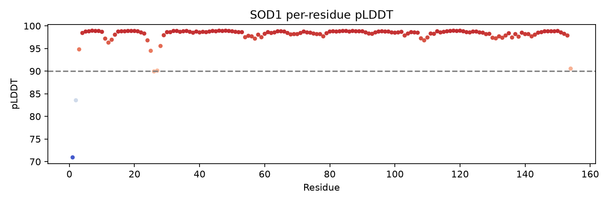
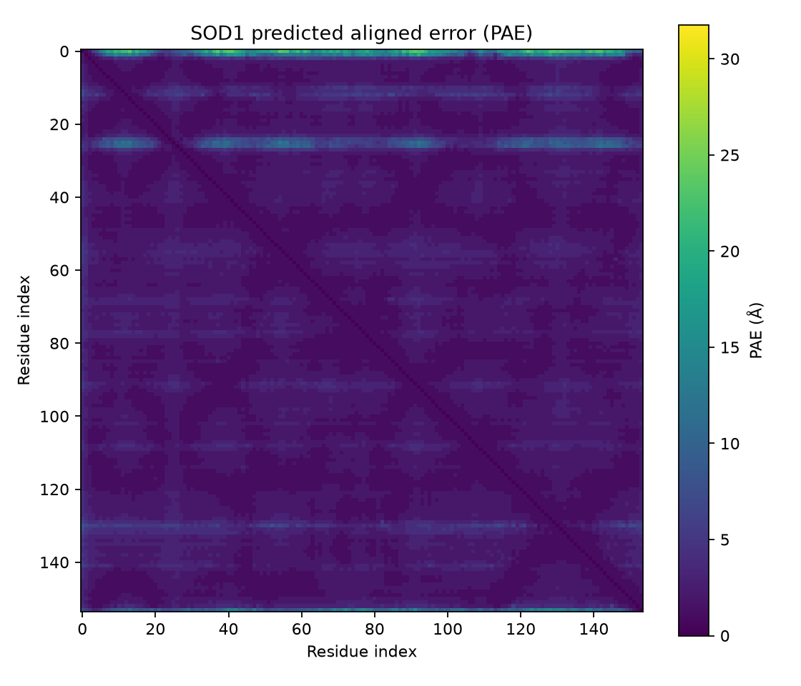

# SOD1 AlphaFold validation transcript

## Check 1 — confidence first

The supplied mmCIF contains one chain and 154 Cα residues. pLDDT is read from `_atom_site.B_iso_or_equiv` (the B-factor column): **min 70.94, max 98.94, mean 97.93**. Residues 1–30 have min 70.94, mean 96.05. The PAE JSON contains a **154×154** intrachain matrix with maximum scale 31.8 Å; its observed range is 0.00–24.00 Å and mean is 2.18 Å.

pLDDT applies to confidence in local residue geometry/fold. PAE applies to confidence in relative placement of residue pairs/domains. This PAE is intrachain only; it is not interface PAE for a second SOD1 chain.

## Check 2 — structure identity and assembly

The FASTA is 154 residues. The mmCIF has one chain A, residue IDs 1–154, with no gaps in the Cα residue numbering. Its residue sequence matches `data/SOD1.fasta` exactly; no mutations were found. The model is therefore the canonical human SOD1 monomer, not the functional two-copy assembly described in the transcript. No second chain or inter-chain PAE is present.

## Check 3 — visual inspection

The pLDDT rendering is in `sod1_structure_colored.png`; high-confidence core residues appear red/pink and lower-confidence terminal regions are bluer, consistent with the numerical profile (Met1 is 70.94). The PAE heatmap is predominantly low within the compact fold, with higher uncertainty in weaker/terminal relative placements. This is consistent with a well-supported single-chain fold, but neither visualization establishes the missing dimer interface.

## Check 4 — biological caveat

**Caveat: the model contains no explicit Cu/Zn ligands or metals.** SOD1 activity and geometry depend on metal coordination; without modeled metal occupancy and a paired functional assembly, a surface residue can appear plausible while affecting metal-site geometry or dimerization. Thus this model cannot establish that any mutation is safe or surface-specific in Erik's enzyme.

## Conclusion

The supplied model supports a high-confidence canonical **monomeric fold**, with the confidence metrics above. It does **not** support the stronger claim about safe residues in the functional SOD1 dimer: interface placement is unmodeled, and Erik's exact construct remains unverified.
